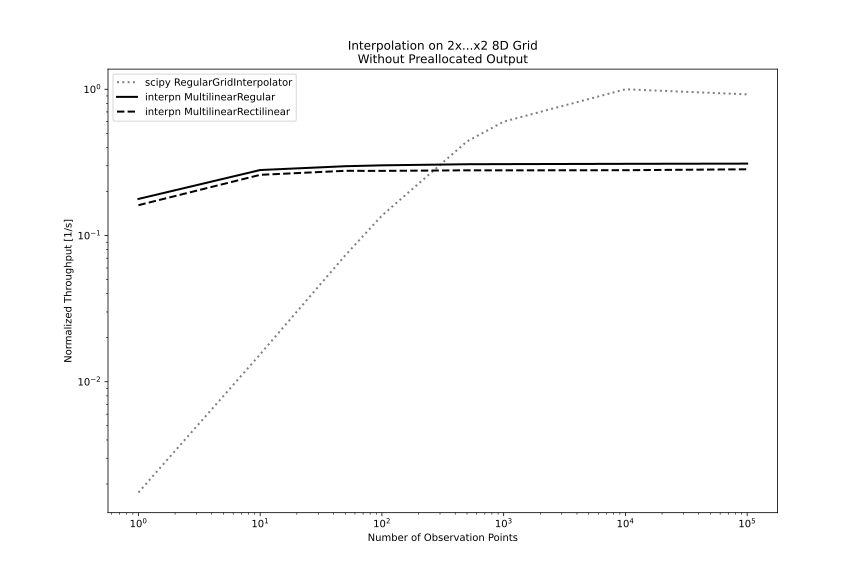

# Performance

## Speed

More commentary about low-level perf scalings for each method
can be found in the [documentation for the Rust library](https://docs.rs/interpn/latest/interpn/).

By comparison to `scipy.interpolate.RegularGridInterpolator`,
the `interpn.MultilinearRegular` and `interpn.MultilinearRectilinear`
methods do exceptionally well for small numbers of observation points,
and are roughly at parity for large numbers of observation points. 

They are also exceptionally good for working with large grids,
as they do not allocate any significant amount of storage during
setup or evaluation unless the inputs must be reallocated to match data types or be made contiguous.

These methods are also somewhat slower in extrapolation, but rarely
far from parity.

For 1D interpolation, these methods will work, but special-purpose
1D interpolation functions like `numpy.interp` will tend to perform
better.

### 3D linear interpolation
The crunchiness of the RegularGridInterpolator throughputs above 1e4 elements is repeatable, but disappears under lower allocation load (if a preallocated output is used for `interpn`).

### 8D linear interpolation
Samples with larger numbers of observations points are expensive to obtain.

----
## Memory Usage

----
## Quality-of-Fit

The cubic interpolation method used in InterpN is slightly different from a B-spline, which is part of what allows it to achieve higher throughput. This fit method, which uses first derivative BCs at each grid point on the interior region and a "natural spline" (zero third derivative) at the grid edges, also produces a similar-or-better quality fit by most metrics. This method also prioritizes correctness of values and first derivatives over maintaining a continuous second derivative.

### 1D Cubic Interpolation & Extrapolation

### 2D Cubic Interpolation & Extrapolation
