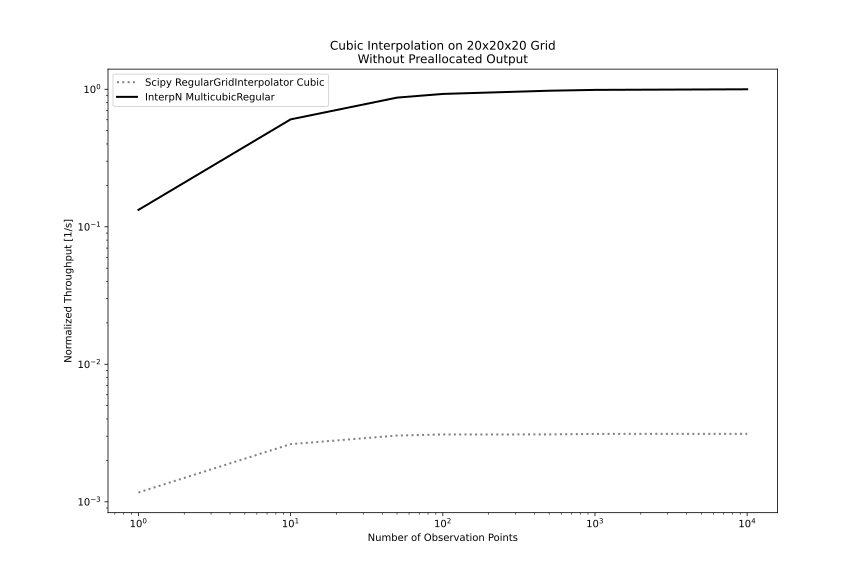
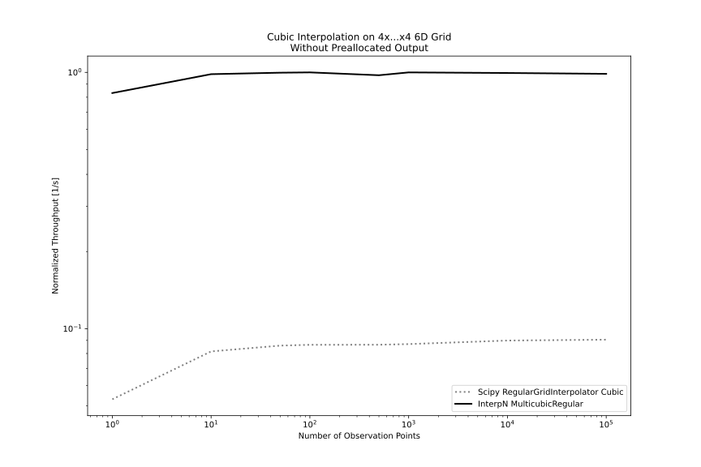

# Performance

## Speed

More commentary about low-level perf scalings for each method
can be found in the [documentation for the Rust library](https://docs.rs/interpn/latest/interpn/).

By comparison to `scipy.interpolate.RegularGridInterpolator`,
InterpN linear methods do exceptionally well for small numbers of observation points, and are roughly at parity for large numbers of observation points. InterpN cubic methods are significantly faster across all tested conditions.

They are also exceptionally good for working with large grids,
as they do not allocate any significant amount of storage during
setup or evaluation unless the inputs must be reallocated to match data types or be made contiguous.

These methods are also somewhat slower in extrapolation, but rarely
far from parity.

For 1D interpolation, these methods will work, but special-purpose
1D interpolation functions like `numpy.interp` will tend to perform
better.

### Linear interpolation in 3D and 6D

    
    

### Cubic interpolation in 3D and 6D

    
    

----
## Memory Usage

----
## Quality-of-Fit

The cubic interpolation method used in InterpN is slightly different from a B-spline, which is part of what allows it to achieve higher throughput. This fit method, which uses first derivative BCs at each grid point on the interior region and a "natural spline" (zero third derivative) at the grid edges, also produces a similar-or-better quality fit by most metrics. This method also prioritizes correctness of values and first derivatives over maintaining a continuous second derivative.

### 1D Cubic Interpolation & Extrapolation

### 2D Cubic Interpolation & Extrapolation
