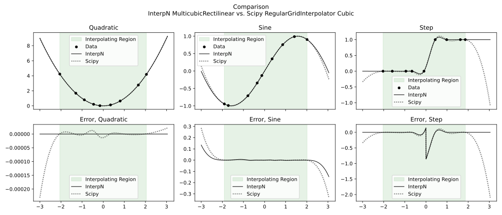
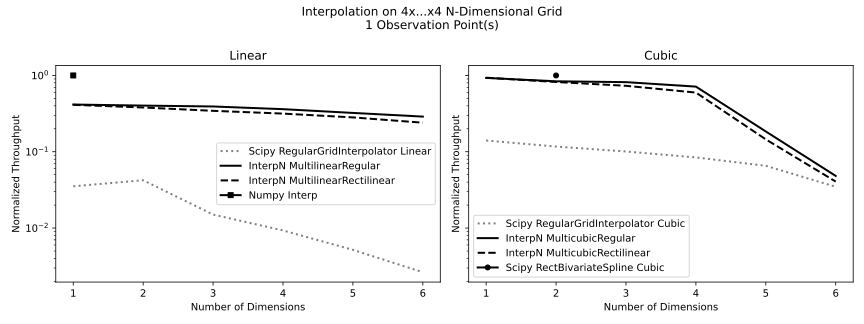
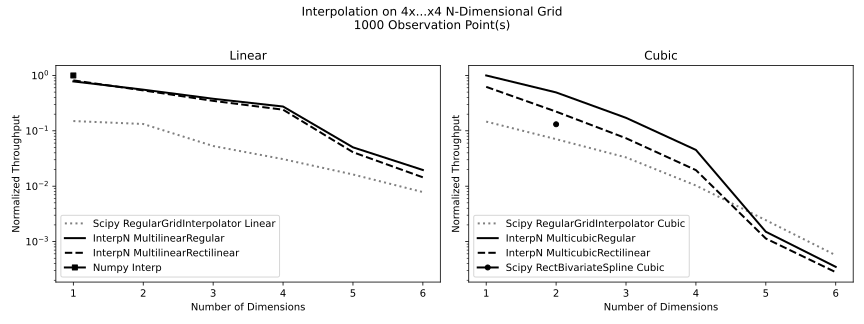
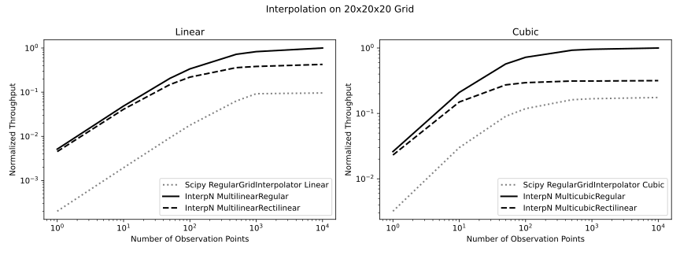

# Performance

## Quality-of-Fit

The cubic interpolation method used in InterpN is slightly different from a B-spline, which is part of what allows it to achieve higher throughput. This fit method, which uses first derivative BCs at each grid point on the interior region and a "natural spline" (zero third derivative) at the grid edges, also produces a similar-or-better quality fit by most metrics. This method also prioritizes correctness of values and first derivatives over maintaining a continuous second derivative.

The linear methods' quality of fit, being linear, is not very interesting.

### 1D Cubic Interpolation & Extrapolation
InterpN shows significantly improvements in both numerical error and quality-of-fit, especially where sharp changes or strong higher derivatives are present. 

### 2D Cubic Interpolation & Extrapolation
Both methods can full capture a quadratic function in arbitrary dimensions, including under extrapolation. However, InterpN produces an order of magnitude less floating point error, despite requiring significantly less run time.

----
## Throughput

More commentary about low-level perf scalings for each method
can be found in the [documentation for the Rust library](https://docs.rs/interpn/latest/interpn/).

By comparison to `scipy.interpolate.RegularGridInterpolator`,
InterpN linear methods do exceptionally well for small numbers of observation points, and are roughly at parity for large numbers of observation points. InterpN cubic methods are significantly faster across all tested conditions, although `scipy.interpolate.RectBivariateSpline` is notably slightly faster for the special case of 2 dimensional data.

The InterpN methods are also exceptionally good for working with large grids,
as they do not allocate any significant amount of storage during
setup or evaluation unless the inputs must be reallocated to match data types or be made contiguous.

InterpN's linear methods are also somewhat slower in extrapolation, but rarely
far from parity.

For 1D interpolation, these methods will work, but special-purpose
1D interpolation functions like `numpy.interp` will tend to perform
better.

----
### Throughput vs. Dimensionality
The same performance trends persist with grids of dimension 1-6, with an unusual regime change apparent in the scipy cubic trace between dimensions 1 and 2. Scipy's RectBivariateSpline, while only usable for 2D data, is included to compare to a more similar algorithm for evaluation.

#### 1 Observation Point

#### 1000 Observation Points

### 3D Throughput vs. Input Size

----
## Memory Usage

Memory profiling in Python is an odd activity. `memory_profiler` is used here, and may miss some memory usage in extension libraries. Also for this reason, the memory profiler is unable to capture the memory used by scipy to actualize the spline knots during initialization, and a comparison of profiled memory usage during initialization is unenlightening.

Since InterpN's backend library does not have access to an allocator, it's unlikely that there is much hidden behind that interface during evaluation. However, it is possible that some memory used by scipy is not identified by the profiler.

The linear methods all use roughly the same amount of RAM during evaluation. In the case of InterpN, as designed, the instantaneous memory usage of all the methods, both linear and cubic, is the same during evaluation.

The memory profiler picks up a large amount of RAM that is not actually part of the function evaluation, but belongs to the outer process. As a result, all methods show a bogus memory usage floor of about 97MB.

